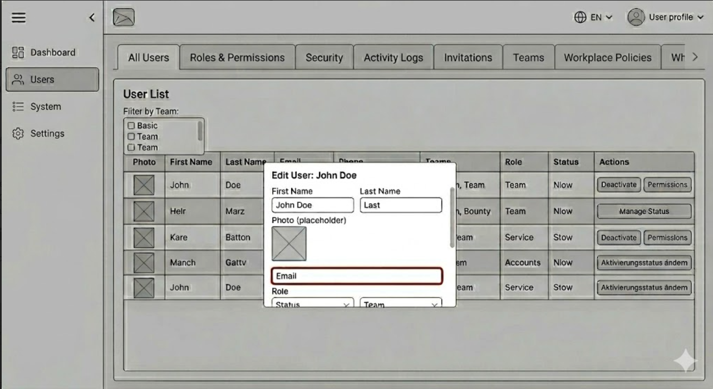
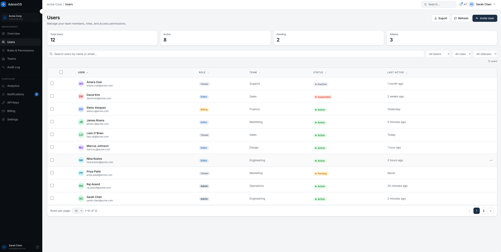
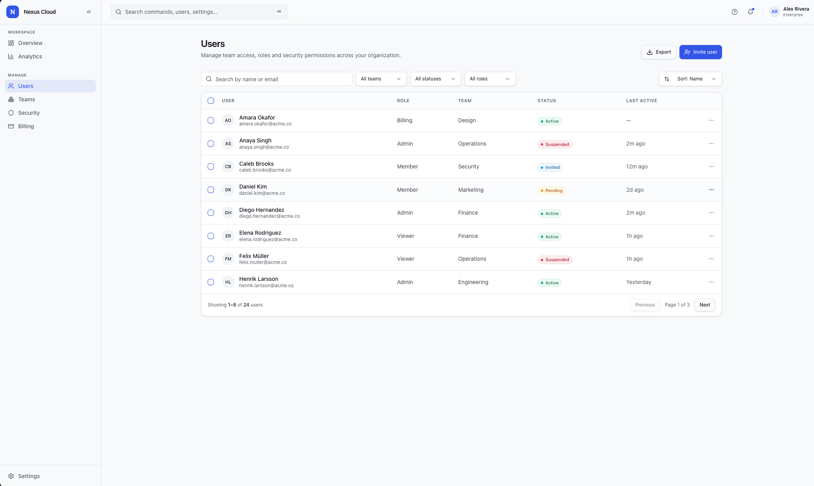
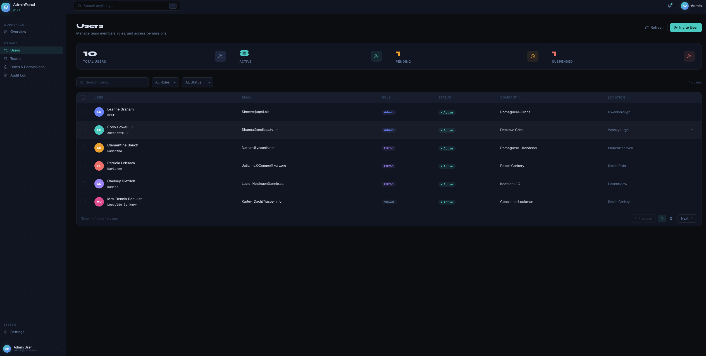

# User Management Dashboard

A frontend assignment built as a direct comparison of three AI-assisted implementation approaches.

The starting point was a rough AI-generated wireframe. I audited it for UX problems, wrote a single detailed base prompt, and gave it independently to three platforms. Each produced its own interpretation of the same dashboard — all three are live and accessible side by side.

## Live Demo

| Version | Platform | URL |
|---|---|---|
| Final / v0 | [v0](https://v0.dev) by Vercel | [/](https://user-management-admin-panel.netlify.app/) |
| v1 | [Lovable](https://lovable.dev) | [/v1](https://user-management-admin-panel.netlify.app/v1) |
| v2 | Claude Code (`/frontend-design` skill) | [/v2](https://user-management-admin-panel.netlify.app/v2) |

## Screenshots

### Original Wireframe


### v0 — Vercel v0


### v1 — Lovable


### v2 — Claude Code


## Repository

[GitHub Repository](https://github.com/savety6/user-management-admin-panel)

---

## Tech Stack

- **React 19**
- **TypeScript 6**
- **Vite 8**
- **Tailwind CSS v4** — config-free, uses `@tailwindcss/vite` plugin and `@theme inline` CSS variables
- **shadcn/ui v4** (radix-nova style) + **`radix-ui` monorepo package** (unified Radix UI primitives)
- **Redux Toolkit v2 + React Redux v9** — global state and RTK Query for data fetching with optimistic updates
- **React Router DOM v7** — client-side routing with versioned app shells (`/`, `/v0`, `/v1`, `/v2`)
- **React Hook Form v7 + @hookform/resolvers v5**
- **Zod v4** — schema validation
- **Sonner v2** — toast notifications
- **Lucide React** — icons
- **Geist Variable** (`@fontsource-variable/geist`) — primary font
- **Bun** — package manager

---

## Features

- Three fully functional UI versions at `/`, `/v1`, and `/v2` — each a distinct redesign of the same dashboard
- [JSONPlaceholder](https://jsonplaceholder.typicode.com) used as a mock seed source, with dashboard behavior handled client-side
- Optimistic updates — edits and deletes reflect instantly without waiting for the (mock) API response
- Sidebar-style tab navigation with sections for Users, Teams, Roles & Permissions, Audit Log, and Settings
- Stats bar showing Total, Active, Pending, and Suspended user counts
- User table with avatar (initials-based), name, username, email, role badge, status badge, company, and location
- Inline editing — hover any name, username, or email cell to edit it directly in the table
- Full edit modal with all user fields, grouped sections, and form validation (react-hook-form + Zod)
- Invite User entry point included as the create flow placeholder for adding new users
- Delete confirmation dialog
- Sortable columns — click any column header to sort ascending or descending
- Search by name, email, username, company, or city
- Filter by role and status
- Multi-row checkbox selection with a bulk action bar
- Pagination (6 rows per page in v0/v2, 8 in v1)
- Skeleton loading states while data is fetching
- Empty state when no users match the active filters
- Toast notifications for all create, update, and delete actions

---

## Project Scope

The application is a frontend-only prototype with no custom backend, no authentication, and no database.

[JSONPlaceholder](https://jsonplaceholder.typicode.com) is used as a mock seed source instead of a real production backend. The assignment requested a frontend-only prototype, so the application does not rely on real persistence. Meaningful dashboard behavior such as searching, filtering, sorting, editing, deleting, pagination, selection, loading states, and optimistic UI feedback is handled in the browser.

Mutations are sent to JSONPlaceholder, which returns a fake success response but does not actually persist changes server-side. To prevent the UI from reverting after a mutation, the project uses **optimistic updates** via RTK Query's `onQueryStarted` hook — the cache is patched immediately and rolled back automatically if the request fails. Changes therefore appear permanent within a session but reset on page refresh.

There is no authentication. The user is assumed to already be logged in as a system administrator.

---

## UX Audit

The provided wireframe represented a rough AI-generated concept. It had several issues that would make the interface difficult to use in a real admin environment.

### 1. Poor scalability for larger user lists

The original layout did not clearly show how it would handle many users. In real workplace administration tools, user lists can quickly grow from a few users to hundreds or thousands.

**Fix:**  
I redesigned the main section around a structured user list with search and filters. This makes the dashboard easier to scan and more practical for larger datasets.

---

### 2. Missing filtering and discovery patterns

The wireframe did not provide a clear way to find specific users. Without filtering, admins would be forced to manually scan the entire list.

**Fix:**  
I added search and filtering controls. Users can be filtered by role and status, while the search input supports matching by name, email, username, company, or city.

---

### 3. Unsafe destructive actions

The original concept did not clearly define how deleting a user should work. Direct deletion from a table row or card can easily lead to accidental data loss.

**Fix:**  
I added a delete confirmation dialog. The user must explicitly confirm before a record is removed from the list.

---

### 4. Missing add and edit interaction flow

The wireframe did not properly define how adding or editing a user should happen.

**Fix:**  
I implemented a modal-based edit flow and an inline editing mode for individual fields directly in the table. This keeps the admin in context without navigating away. An Invite User entry point is included as the create flow placeholder, showing where adding a new user would be handled in the full product flow.

---

### 5. Missing validation states

The original design did not define validation behavior for required fields, invalid emails, or incomplete forms.

**Fix:**  
I added form validation for required fields including name, username, email, role, and status. Inline cell edits validate on commit and reject empty or malformed values. The full edit modal uses React Hook Form with Zod for schema-level validation.

---

### 6. Missing empty states

The wireframe did not show what happens when there are no users or when filters return no results.

**Fix:**  
I added an empty state that explains when no users match the current search or filter criteria. This prevents the UI from feeling broken or unfinished.

---

### 7. Weak visual hierarchy

The rough design did not clearly separate page title, primary actions, filters, navigation, and user data.

**Fix:**  
I improved the layout hierarchy by adding a clear page header, a primary action button, grouped filter controls, sidebar-style tab navigation with distinct sections, and visually distinct table rows with status and role badges.

---

### 8. Unclear role and status representation

Role and status are important admin concepts, but the original wireframe did not make them visually easy to scan.

**Fix:**  
I represented roles and statuses with badges. This makes active/inactive users and admin/user roles easier to identify at a glance.

---

### 9. Text overflow and edge cases

The original design did not account for long names, long emails, or narrow screens.

**Fix:**  
I handled long text using truncation and spacing rules. Long values are clamped with ellipsis so the table stays readable regardless of content length.

---

### 10. Missing responsive behavior

The wireframe did not define how the dashboard should behave on smaller screens.

**Fix:**  
I made the layout responsive. Filters wrap on smaller screens, spacing adapts, and the user list remains usable without breaking the page layout.

---

### 11. Missing accessibility considerations

The original design did not clearly address keyboard usage, dialog accessibility, labels, or focus states.

**Fix:**  
I used accessible UI primitives where possible, added visible labels, ensured dialogs have clear titles and actions, and kept interactive controls keyboard-friendly.

---

### 12. Missing loading and error states

Although the assignment uses mocked client-side data, the original design did not consider loading or error states that would be required in a production version.

**Fix:**  
Because this implementation uses JSONPlaceholder as a mock seed source, I added skeleton loading states while data is fetched. In a production version, I would add more complete error recovery, retry actions, and offline handling.

---

## Design Improvements

The main goal of the redesign was to make the dashboard feel like a practical admin tool rather than a static mockup.

Key improvements:

- Added a clear page header with title, description, and primary action
- Used sidebar-style tab navigation to organize the administration sections
- Added search and filters above the user table
- Used badges for roles and statuses to make them scannable at a glance
- Added an inline edit mode for individual fields directly in the table
- Added a full edit modal with grouped fields and form validation
- Added an Invite User entry point as the create flow placeholder
- Added confirmation before deleting a user
- Added form validation and clear error messages
- Added empty states for no matching results
- Improved spacing, alignment, and visual hierarchy
- Improved responsiveness for smaller screens with a collapsible sidebar
- Built three distinct UI versions at `/`, `/v1`, and `/v2` to explore different visual directions

---

## Dashboard Sections

Each version shares the same sidebar-style tab navigation structure:

- **Overview** — placeholder
- **Users** — fully functional user management (the primary working section)
- **Teams** — placeholder
- **Roles & Permissions** — placeholder
- **Audit Log** — placeholder
- **Settings** — placeholder

All routes except Users show a "Coming soon" state. I used sidebar-style tab navigation instead of horizontal tabs because the number of dashboard sections is relatively large. This keeps the layout more scalable on desktop while still preserving the assignment idea of separated dashboard sections without overbuilding features outside the requested scope.

---

## Data Model

Each user is typed via Zod inference against the JSONPlaceholder response shape:

```ts
type User = {
  id: number;
  name: string;
  username: string;
  email: string;
  phone: string;
  website: string;
  address: {
    street: string;
    suite: string;
    city: string;
    zipcode: string;
    geo: { lat: string; lng: string };
  };
  company: {
    name: string;
    catchPhrase: string;
    bs: string;
  };
};
```

`role` and `status` are not part of the API response. They are derived client-side by `getUserRole(id)` and `getUserStatus(id)` in `src/features/users/utils.ts`, which map user IDs to deterministic values so the UI always renders consistent badges across sessions.

---

## Client-Side State

User data is seeded from the [JSONPlaceholder](https://jsonplaceholder.typicode.com) REST API and cached in the Redux store via RTK Query. The following operations are handled client-side:

- Opening the Invite User create flow placeholder
- Editing a user (inline cell edit or full modal)
- Deleting a user
- Searching users
- Filtering users by role and status
- Sorting columns
- Paginating results
- Bulk-selecting rows

Mutations are sent to the API, which returns a fake success response but does not persist changes. To prevent the UI from reverting, optimistic updates patch the RTK Query cache immediately via `onQueryStarted` and roll back automatically on failure. Changes appear permanent within a session but reset on page refresh.

---

## Form Validation

The edit modal uses React Hook Form with a Zod schema and validates the following:

- First name is required
- Last name is required
- Username is required and must contain no spaces
- Email is required and must be a valid email address
- Role is required (admin, editor, or viewer)
- Status is required (active, pending, or suspended)
- Phone, website, company, and city are optional

Inline cell edits in the table apply their own lightweight rules on commit: name cells reject empty values, email cells reject malformed addresses, and username cells reject values containing spaces.

---

## AI Process

The project was built as a direct comparison of three AI-assisted implementation approaches.

I started by studying the assignment brief and conducting a UX audit of the provided wireframe. From that audit I wrote a single detailed base prompt describing the requirements, the data model, the desired features, and the UX decisions.

That same prompt was then given to three different platforms independently:

- **v0** (Vercel) → available at `/`
- **Lovable** → available at `/v1`
- **Claude Code** with the `frontend-design` skill → available at `/v2`

Each platform produced its own interpretation of the dashboard. The results were integrated into this repository as separate versioned routes so they can be compared side by side. No output was treated as final — each version was reviewed and adjusted after generation.

---

## What I Prioritized

1. UX audit and product reasoning
2. Clean dashboard structure across three distinct visual directions
3. Edit, delete, and invite-user entry flows
4. Search, filtering, sorting, and pagination
5. Form validation
6. Empty and loading states
7. Responsive and accessible UI

I intentionally avoided custom backend logic, authentication, and persistent storage beyond the session.

---

## Future Improvements

Given more time, I would add:

- Virtualized lists for very large datasets
- Invite user flow with email confirmation
- Role and permission management UI
- Activity log with real event detail
- Persistent storage or a real backend
- Unit and component tests
- More advanced accessibility testing

---

## Local Setup

Clone the repository:

```bash
git clone https://github.com/savety6/user-management-admin-panel
```

Navigate into the project:

```bash
cd user-management-admin-panel
```

Install dependencies:

```bash
bun install
```

Run the development server:

```bash
bun run dev
```

Build for production:

```bash
bun run build
```

Preview the production build:

```bash
bun run preview
```

If Bun is not installed, the project can also be run with npm:

```bash
npm install
npm run dev
```

---

## Notes

This project is a frontend prototype built to compare three AI-assisted implementation approaches side by side. It is not production-ready — there is no custom backend, no authentication, and no persistent storage.

The implementation focuses on practical UX decisions, mock-seeded data with optimistic client-side updates, and three distinct visual directions that can be evaluated independently at `/`, `/v1`, and `/v2`.
